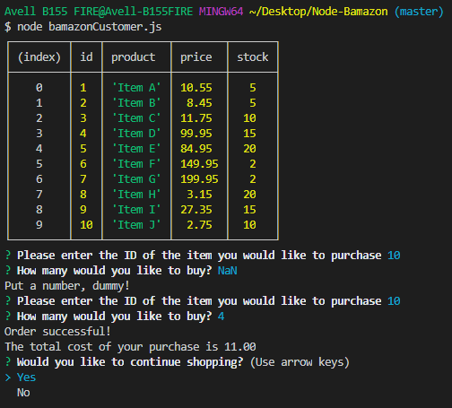
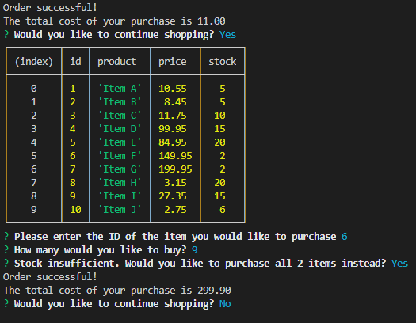
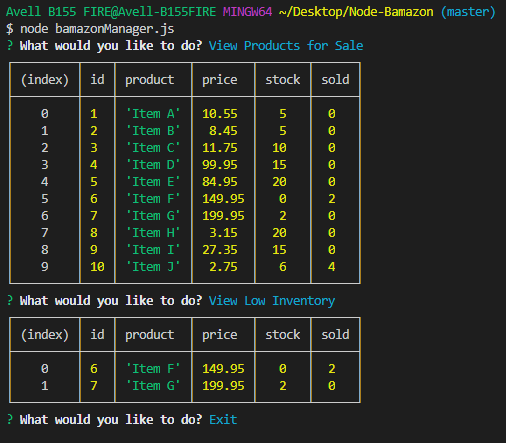
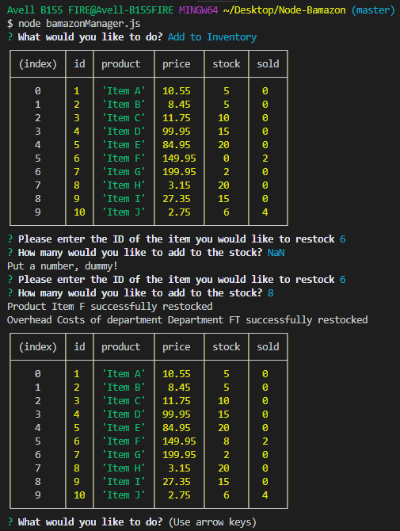
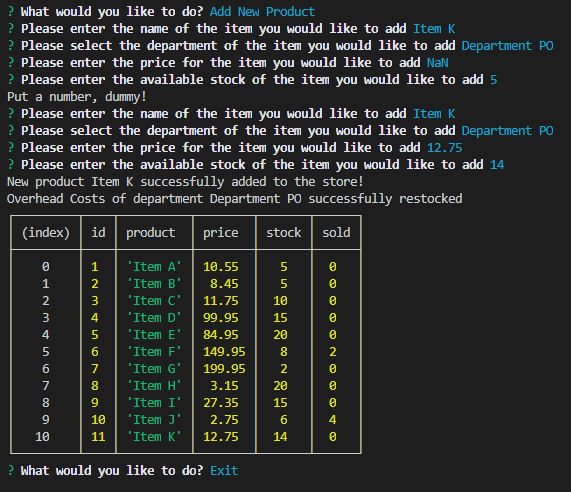
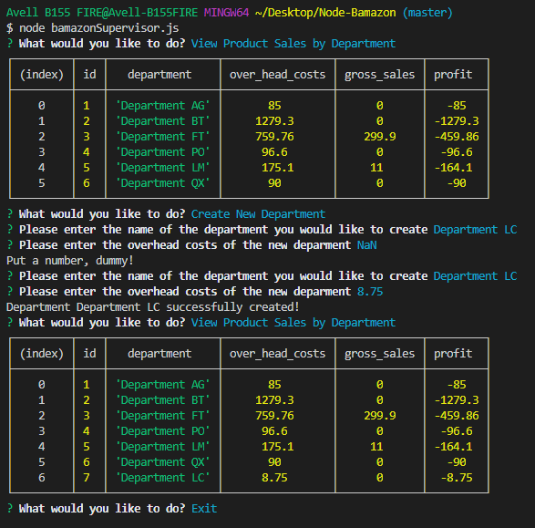

# Node-Bamazon
#
## Getting Started
On the console, type 'npm install' and press enter\
Copy the contents of bamazon.sql and run them in sql to create the database, the tables, and fill them with initial values
#
## bamazonCustomer.js
This is the customer file\
The customer is presented with a table of the current items for sale and can buy products, selecting the ID of the item they want and how many they want to purchase\
Entering non-numeric values on fields that require numbers will give the user an error message and request them to enter the information again\
After each purchase the user is asked if they would like to continue shopping
#

#
If the customer attemps to purchase more items than the available stock he is asked if he wants to purchase all items instead\
If the customer doesn't want to keep shopping the program ends
#

#
## bamazonManager.js
This is the manager file\
The manager is given the options:
 - View products for sale\
    Which will show all products for sale
 - View low inventory\
    Which will show all prodducts with fewer than 5 units in stock
 - Add to inventory\
    Which will allow them to increase the stock of any existing product by any amount they wish
 - Add new product\
    Which will allow them to add a new product to the inventory
#
If they select "Add new product" they will be asked to enter the name, department, price and stock of the new product\
Whenever a product is restocked or a new product is added the overhead costs of the corresponding department are increased by (product price) X (units added) X (0.4)\
While a fixed overhead cost of 40% of the price per unit is not a real life scenario it seemed useful to test the code\
Entering non-numeric values on fields that require numbers will give the user an error message and request them to enter the information again\
After each action the user is asked if they would like to continue
#

#

#

#
## bamazonSupervisor.js
This is the supervisor file\
The supervisor is given the options:
- View products sales by department\
    Which will show all departments
- Create new department\
    Which will allow them to create a new department
#
The values are shown by department and calculated by adding together the corresponding values of each item in that department\
If they select "Create new department" they will be asked to enter the name and the overhead costs of the new department\
While they may enter an overhead cost other than 0 the department will be created with no products and the overhead cost will be increased with every product added to it\
Entering non-numeric values on fields that require numbers will give the user an error message and request them to enter the information again\
After each action the user is asked if they would like to continue
#

#